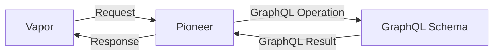
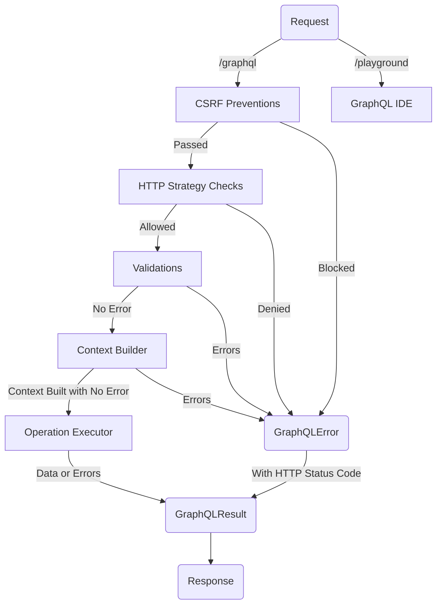
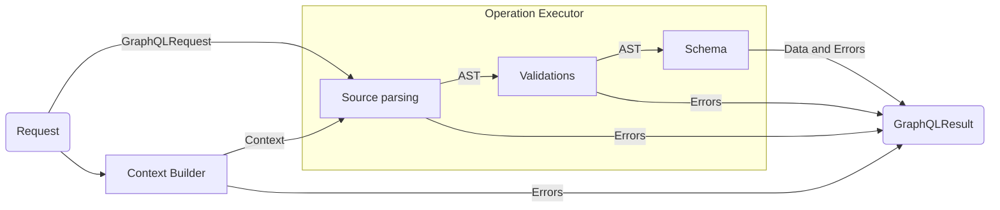
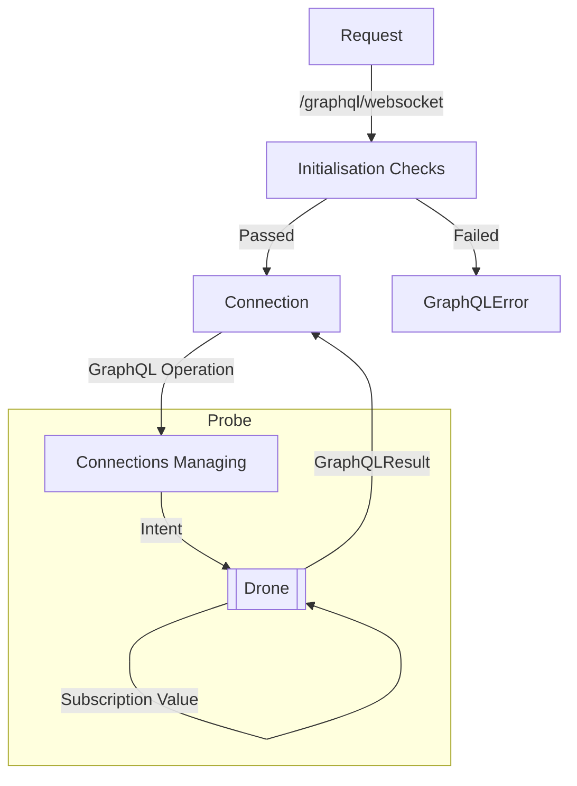
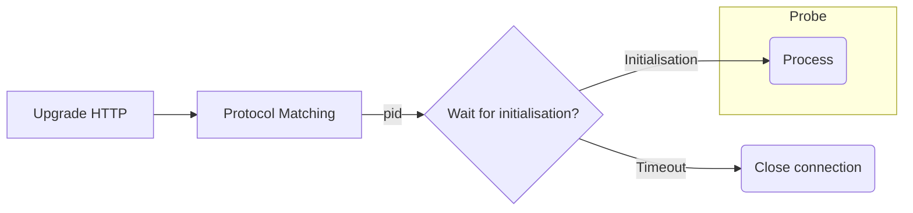
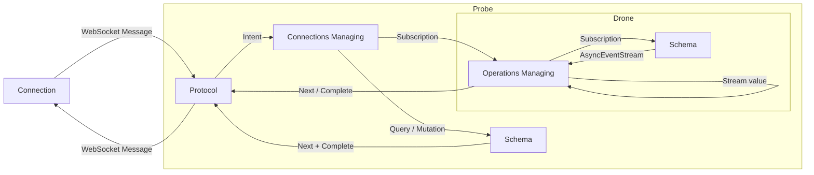

# Flow

This page describe the flow and more detailed overview on how Pioneer works.

## Pioneer, Vapor, and the Schema

On a high level, Pioneer acts as a translator for HTTP and WebSocket to GraphQL that sits between your Vapor server and your GraphQL schema (and resolvers).

<small> HTTP / WebSocket Requests are translated into GraphQL operation, and GraphQL results are translated back into proper HTTP / WebSocket Responses </small>

### HTTP Request into GraphQL operation

Pioneer follows [GraphQL over HTTP spec](https://graphql.org/learn/serving-over-http/) to handle any HTTP requests.

#### Request to Response
Pioneer add some additional checks and processes to the overall GraphQL process either to validate request or to proper format and encode responses.

#### Operation Executor

The operation executor will handle passing down the validated AST from the operation to the schema to be executed.

### WebSocket into GraphQL operation

WebSocket works differently from HTTP. Pioneer follow 2 [GraphQL over WebSocket](/features/graphql-over-websocket.md) protocols, [subscriptions-transport-ws (`graphql-ws`)](https://github.com/apollographql/subscriptions-transport-ws/blob/master/PROTOCOL.md) and [graphql-ws (`graphql-transport-ws`)](https://github.com/enisdenjo/graphql-ws/blob/master/PROTOCOL.md). There are different process involved depending on the type of operations, and additional initialisation process for setting up WebSocket and the appropriate actors. 

#### WebSocket connection initialisation

Pioneer will manually handle the protocol upgrade HTTP request to initialise the WebSocket connection.

Depending on which protocol is being used, the initialisation process might defer slightly, but the general ideas are:

1. The `Sec-WebSocket-Protocol` will be matched with the chosen [GraphQL over WebSocket protocol](/features/graphql-over-websocket.md).
2. Each connection will be assigned a unique process identifier (`pid`).
3. A timeout task will be created for the `pid` for a specified length.
4. Pioneer will now wait for a initialisation message / handshake (according to the chosen [protocol](/features/graphql-over-websocket.md) specifications).
    - If a initialisation message is received, the timeout task will be cancelled and a process is created using the `pid` before sending it to the connections actor (`Probe`).
    - If no initialisation message is received before the timeout, the connection will be closed immediately

#### WebSocket operation requests
Operations are decoded by the chosen protocol into intents which are understandable by the handlers.

- If the intent is to run a query or mutation (stateless operation), `Probe` will immediately execute the operation given using the schema on a seperate `Task`. Once the `GraphQLResult` is returned, it will sent a `Next` message using the protocol and another message `Complete` to indicate the end of the operation.
- If the intent is to run a subscription (stateful operation), Probe will delegate the operation to the connection specific `Drone`. `Drone` will then execute the operation, subscribe to the [AsyncEventStream](/features/async-event-stream.md) on a seperate `Task`, and send back each value to itself before sending a `Next` message with the value.

