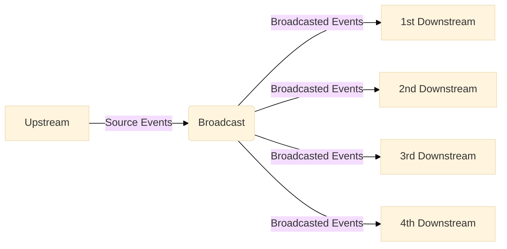

# Subscriptions

## Resolving a subscription

Resolvers for `Subscription` fields differ from resolvers for fields of other types. Specifically, `Subscription` field resolvers require to return an implementation of `EventStream`.

!!!success Websocket Context Building
Since `0.7.0`, Pioneer allow a seperate context builder for the websocket operations where it provide a different set of arguments, and will be using that to build context in a websocket.

Subscription in Pioneer run through websocket so it will use that websocket context builder.

[!ref More on Websocket Context](/guides/features/graphql-over-websockets/#websocket-context)

!!!

```swift Resolver.swift
struct Resolver {
    // Example using an async generator
    func hello(_: Context, _: NoArguments) async -> EventStream<String> {
        let stream = AsyncStream { con in
            for word in ["Hello", "Bonjour", "Ciao"] {
                con.yield(word)
            }
            con.finish()
        }
        return stream.toEventStream()
    }

    func postCreated(ctx: Context, _: NoArguments) async -> EventStream<Post> {
        ctx.pubsub.asyncStream(Post.self, for: "POST_CREATED").toEventStrem()
    }
}
```

The resolver function must return an `EventStream` built from [`AsyncEventStream`](/guides/features/async-event-stream) which can come from any `AsyncSequence`, a standard protocol in Swift 5.5 for asynchronous, sequential, iterated elements.

## AsyncPubSub

Pioneer provide an in memory publish-subscribe (**Pub/Sub**) model named, [AsyncPubSub](/references/async-pubsub), to concurrent safely track events and update all active subscribers.

[AsyncPubSub](/references/async-pubsub) conforms to [PubSub](/references/protocols/#pubsub) which enables your server code to both publish events to a particular topic/trigger/trigger and listen for events associated with a particular topic.

```swift
import Pioneer

let pubsub = AsyncPubSub()
```

### Publishing an event

You can publish an event using the [`publish`](/references/async-pubsub/#publish) method:

```swift
await pubsub.publish("POST_CREATED", Post(by: "Jeff Bezos", content: "How much many do I have"))
```

- The first parameter is the trigger of the event you're publishing to, as a string.
  - You don't need to register a trigger name before publishing to it.
- The second parameter is the payload associated with the event.

As an example, let's say our GraphQL API supports a `createPost` mutation

+++ Resolver
A basic resolver for that might look this.

```swift
struct Resolver {
    ...

    func createPost(ctx: Context, args: CreatePostArgs) async throws -> Post {
        let post = Post(args: args)
        try await post.create(on: ctx.req.db)
        return post
    }
}
```

+++ Schema

The example schema in swift

```swift
Mutation {
    Field("createPost", at: Resolver.createPost) {
        Arguments("author", at: \.author)
        Arguments("content", at: \.content)
    }
}
```

The example schema in GraphQL SDL

```graphql
type Mutation {
  createPost(author: String, content: String): Post!
}
```

+++

After we successfully persist the new post into the database, we can publish it to the pubsub as an event.

```swift
struct Resolver {
    ...

    func createPost(ctx: Context, args: CreatePostArgs) async throws -> Post {
        let post = Post(args: args)
        try await post.create(on: ctx.req.db)
        await ctx.pubsub.publish(for: "POST_CREATED", post)
        return post
    }
}
```

Next, we can listen for this event in our `Subscription` resolver.

### Listening for events

An AsyncStream asynchronously iterate over events, and if that stream comes from a [PubSub](/references/protocols/#pubsub), it will be associated with a particular trigger and will receive the events published under that trigger.

You can create an AsyncStream by calling the [asyncStream](/references/protocols/#asyncstream) method of [PubSub](/references/protocols/#pubsub) and passing in a the event trigger that this stream should listen for and the type.

```swift
pubsub.asyncStream(Post.self, for: "POST_CREATED");
```

Which brings us back to the [example](#resolving-a-subscription) above.

```swift Resolver.swift
struct Resolver {
    ...

    func postCreated(ctx: Context, _: NoArguments) async -> EventStream<Post> {
        ctx.pubsub.asyncStream(Post.self, for: "POST_CREATED").toEventStrem()
    }
}
```

## Custom Pub/Sub

As mentioned before, [AsyncPubSub](/references/async-pubsub) is an in memory pub-sub implementation that is limited to a single server instance, which may become an issue on production environments where there are multiple distributed server instances.

In which case, you likely want to either use or implement a custom pub-sub system that is backed by an external datastore.

### PubSub as protocol

!!!success Integration
Pub/Sub implementation conform to this protocol is enforced to have the same API to [AsyncPubSub](/references/async-pubsub), which make easy to switch between.

However, it is **not necessary** to use PubSub for your subscription resolver and to build a custom Pub/Sub implementation.
!!!

Pioneer exported the [PubSub](/references/protocols/#pubsub) protocol which allow different implementation with the same API [AsyncPubSub](/references/async-pubsub) notably implementation backed by popular event-publishing systems (i.e. Redis) with similar API which allow user of this library to prototype with the in memory AsyncPubSub and easily migrate to a distributed PubSub implementation without very little changes.

The basic rules to implement A [PubSub](/references/protocols/#pubsub) are as follow:

||| Conformance

The method `asyncStream` should return an `AsyncStream` for a single subscriber where it can be unsubscribed without closing the topic entirely.

- The type of `DataType` should conform to `Sendable` and `Decodabble` to help make sure it is safe to pass around and be able to decoded if necessary (since it is likely to come from a network call).
- Recommended to create a new `AsyncStream` on each method call.
- If you are having trouble with broadcasting a publisher to multiple consumer/subscriber, recommended taking a look at [Broadcast](#broadcast).

The method `publish` should publish events to all subscriber that associated with the trigger.

- The `DataType` conform to `Sendable` and `Encodable` to help make sure it is safe to pass around and be able to encoded if necessary (since it is likely to be send on a network call).

The method `close` should dispose and shutdown all subscriber that associated with the trigger.

|||

||| Data races and asynchronous scope.

The implementation should be free of data races and be working safely under asynchronous scopes.

- If you are having trouble with data-race safe state management, recommended use Swift 5.5 [`Actor`](https://developer.apple.com/documentation/swift/actor).

|||

[!ref More on PubSub specification](/references/protocols/#pubsub)

### Broadcast

Additionally, common client libraries for popular event-publishing systems usually only provide a function that to subscribe to a specific publisher, but

- No option of unsubscribing without closing the publisher entirely
- Only allow 1 subscriber for each publisher / channel
  - Usually because subscription is its own new network connection and multiple of those can be resource intensive.

In this case, the actor, [Broadcast](/references/actors/#broadcast), is provided which can broadcast any events from a publisher to multiple different downstream where each downstream share the same upstream and can be unsubscribed / disposed (to prevent leaks) without closing the upstream and publisher.



[Broadcast](/references/actors/#broadcast) provide the methods:

- `downstream` to create a new subscriber stream that will receive events broadcasted
- `publish` to broadcast the events to all subscriber
- `close` to close the broadcast and shutdown all subscriber

Essentially, it will be applied on a event publisher to create multiple downstream(s) and handle distribution of events, where:

- Different consumer can subscribe to the same upstream and all of them get the same messages
  - Usually to prevent making multiple subscription might be resource intensive
- [Downstream(s)](/references/structs/#downstream) can be disposed, stopped, or cancelled individually to prevent leaks
  - Disposed by cancelling `Task` used to consume it
- Closing any [downstream(s)](/references/structs/#downstream) does not close other downstream(s), broadcast, and upstream
  - Other [downstream(s)](/references/structs/#downstream) will continue receiving broadcasted events
- Closing broadcast dispose all downstream(s), but not necessarily the upstream

==- Example

```swift
let broadcast = Broadcast<Event>()
receiveSubscriptionFromExternalPublisher(
    ...,
    onMessage: { msg async in
        let event = convertToEvent(msg)
        await broadcast.publish(event)
    },
    onFinished: { reason async in
        await broadcast.close()
    }
)

// All of these downstream are getting all messages from the upstream
let downstream0 = await broadcast.downstream().stream
let downstream1 = await broadcast.downstream().stream
let downstream2 = await broadcast.downstream().stream
let downstream3 = await broadcast.downstream().stream

sendToExternalPublisher(..., msg: SomeMessage())

// Dispose a downstream without effecting the others
let task3 = Task {
    for await msg in downstream3 {
        // ...
    }
}

task3.cancel()


// Shutdown all downstreams
closeExternalPublisher(...)
await broadcast.close()
```

===

[!ref More on Broadcast specification](/references/actors/#broadcast)

### Redis Example

As an example, say we want to build a redis backed [PubSub](/references/protocols/#pubsub).

!!!warning Untested Example
This is only meant to be an example to give a better idea on how to implement a custom implementation that conform to [PubSub](#pubsub-as-protocol) and utilize [Broadcast](#broadcast).

- It is not tested and it may not even compile.
- Some part of code is intentionally vaguely described.
- This should not be used in a production environment without modified and reviewed

!!!

Here is an example implementation,

```swift RedisPubSub.swift
import Pioneer
import Redis
import Foundation
import NIOFoundationCompat

struct RedisPubSub: PubSub {

    // MARK: - Actor for distribution
    actor Dispatcher {
        private let redis: RedisClient
        private var broadcasting: [String: Broadcast<Data>] = [:]

        private func subscribe(to channel: String) async -> Broadcast<Data> {
            if let broadcast = broadcasting[channel] {
                return broadcast
            }
            let broadcast = Broadcast<Data>()
            broadcasting[channel] = broadcast
            await apply(from: .init(channel), to: broadcast)
            return broadcast
        }

        private func apply(from channel: RedisChannelName, to broadcast: Broadcast<Data>) async {
            do {
                try? await redis.subscribe(
                    to: channel,
                    messageReceiver: { _, msg in
                        guard case .bulkString(.some(let buffer)) = msg else { return }
                        let data = Data(buffer: buffer)
                        Task {
                            await broadcast.publish(data)
                        }
                    },
                    onUnsubscribe: { _, _ in
                        Task {
                            await broadcast.close()
                        }
                    }
                )
                .get()
            } catch {
              await broadcast.close()
            }
        }

        private func publish(for channel: String, _ value: Data) async {
            try? await redis.publish(value, to: .init(channel)).get()
        }

        private func close(for channel: String) async {
            try? await redis.unsubscribe(from: .init(channel))
            await broadcasting[channel]?.close()
        }
    }

    // MARK: -- Protocol required methods


    public func asyncStream<DataType: Sendable & Decodable>(_ type: DataType.Type = DataType.self, for trigger: String) -> AsyncStream<DataType> {
        AsyncStream<DataType> { con in
            let task = Task {
                let pipe = await dispatcher.subscribe(for: trigger)
                for await data in pipe {
                    guard let event = try? JSONDecoding().decode(DataType.self, data) else { continue }
                    con.yield(event)
                }
                con.finish()
            }
            con.onTermination = { @Sendable _ in
                task.cancel()
            }
        }
    }

    public func publish<DataType: Sendable & Encodable>(for trigger: String, payload: DataType) async {
        guard let data = try? JSONEncoder().encode(payload) else { return }
        await dispatcher.publish(for: trigger, data)
    }

    public func close(for trigger: String) async {
        await dispatcher.close(for: trigger)
    }

    // MARK: - Properties

    private let dispatcher: Dispatcher

    public init(_ redis: RedisClient) {
        self.dispatcher = .init(redis: redis)
    }
}
```

Now we can have the context to require [PubSub](/references/protocols/#pubsub) instead of [AsyncPubSub](/references/async-pubsub).

```swift Context.swift
struct Context {
    var pubsub: PubSub
}
```

```swift Resolver.swift
struct Message: Sendable, Codable { ... }

struct Resolver {
    func create(ctx: Context, _: NoArguments) async -> Message {
        let message = ...
        await ctx.pubsub.publish(message)
        return message
    }

    func onCreate(ctx: Context, _: NoArguments) async -> EventStream<Message> {
        ctx.pubsub.asyncStream(Message.self, for: "message-create").toEventStream()
    }
}
```

So now, if we can use the `RedisPubSub` on a production environment.

```swift main
...

let pubsub: PubSub = app.environment.isRelease ? RedisPubSub() : AsyncPubSub()

let server = Pioneer(
    ...,
    contextBuilder: { _, _, in
        Context(pubsub: pubsub)
    },
    websocketBuilder: { _, _, _ in
        Context(pubsub: pubsub)
    },
    ...
)

...
```
