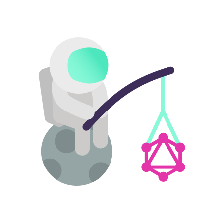

<p align="center">
    
</p>

<p align="center"> 
    <h1>Pioneer</h1>
</p>

Spec-compliant Swift GraphQL server for Vapor.

## Features

- Handle GraphQL execution (synchronous and asynchronous) both on `GET` and `POST` HTTP request.
- Handle GraphQL subscription through WebSocket.
- Handle `Vapor` routing for all types of operations.
- Handle introspection blocking, HTTP strategies, and WebSocket sub-protocols such as  `subscriptions-transport-ws/graphql-ws` or `graphql-ws/graphql-transport-ws`.
- Provide API for `AsyncSequence` to be used as `EventStream`.
- Provide API for `async/await` resolvers.

### Limitations

- Require Swift 5.5, precisely the new `Concurrency`.
- `EventStream` require type casting to be used properly which creates a few limitations: 
	- Can only handle subscription `EventStream` built with `AsyncSequence`.
	- `EventStream` aren't built with `.map` and `.compactMap` as the result type is too complicated to be casted.
	- `AsyncSequence` converted into `EventStream` that does not provide a `onTermination` callback will have no way of deallocating resources.

## Resources

- [Documentation](https://github.com/d-exclaimation/pioneer/blob/main/Sources/Pioneer/Pioneer.swift)


## Usage/Examples

<details open>
<summary>
	<code>main.swift</code>
</summary>

---

```swift
import Vapor
import Pioneer

// Create a new Vapor application
let app = try Application(.detect())

	
// Create a Pioneer server with the schema, resolver, and other configurations
let server = try Pioneer(
    schema: schema(), 
    resolver: Resolver(),
    httpStrategy: .onlyPost, 	   // <- Only run operation through `POST`.
    websocketProtocol: .graphqlWs, // <- Use `graphql-ws/graphql-transport-ws` websocket subprotocol.
    introspection: true		   // <- Allow introspection queries.
)

// Apply Pioneer routing and middlewares to a Vapor app.				 
server.applyMiddleware(on: app)

defer { 
    app.shutdown() 
}

try app.run()
```

---

</details>

---

<details open>
<summary>
	<code>Schema.swift</code>
</summary>

---

```swift
import Graphiti
import Pioneer

// Function to create the Schema	
func schema() throws -> Schema<Resolver, Request> {
    try .init {
        Scalar(ID.self, as: "ID")
        
        Type(Message.self) {
            Field("id", at: \.id)
		.description("Message identifier")
            Field("content", at: \.content)
		.description("Content of the message")
        }
	    .description("Identifiable Message with a content")

        Query {
            Field("hello", at: Resolver.hello)
		.description("Query a generic hello message")
        }

        Mutation {
            Field("wave", at: Resolver.wave) {
                Argument("message", at: \.message)
		    .description("Message content for the new message")
            }
		.description("Send a message to all active listener")
        }

        Subscription {
            SubscriptionField("listen", as: Message.self, atSub: Resolver.listen)
		.description("Be an active listener to all messages")	
	
            SubscriptionField("tick", as: Message.self, atSub: Resolver.tick) {
                Argument("repeats", at: \.repeats)
		    .description("Amount of repetitions")
                Argument("second", at: \.second)
		    .description("Interval in second(s)")
            }
		.description("Query for ticking messages with given repetitions and interval in second(s)")	
        }
    }
}
```

---

</details>

---

<details>
<summary>
	<code>Schema.graphql</code>
</summary>

---

```graphql
"""
Identifiable Message with a content
"""	
type Message {
  "Message identifier"		
  id: ID!
  "Content of the message"	
  content: String!
}


type Query {
  """
  Query a generic hello message
  """	
  hello: Message!
}

type Mutation {
  """
  Send a message to all active listener
  """
  wave(
    "Message content for the new message"
    message: String!
  ): Message!
}

type Subscription {
  """
  Be an active listener to all messages
  """	
  listen: Message!
  """
  Query for ticking messages with given repetitions and interval in second(s)
  """		
  tick(
    "Amount of repetitions"	
    repeats: Int!, 
    "Interval in second(s)"	
    second: Int!
  ): Message!
}

schema {
  query: Query
  mutation: Mutation
  subscription: Subscription
}
```

---

</details>

---

<details open>
<summary>
	<code>Resolver.swift</code>
</summary>

---

```swift
import Pioneer
import Graphiti
import GraphQL
import Desolate

struct Message: Codable {
    var id: ID = .uuid() // <- Using Pioneer built-in ID type for GraphQL's `ID`.
    var content: String 
}

struct Resolver {
    // Desolate package brings a Hot reactive stream similar to Rx's Publisher but use `AsyncSequence` so it can be processed by Pioneer.
    let (jetStream, pipeline) = Jet<Message>.desolate()
    
    // Using Swift 5.5 async / await in resolver. 
    func hello(_: Void, _: NoArguments) async -> Message { 
        Message(content: "Hello World!")
    }
    
    struct Arg: Decodable { 
        var message: String 
    }
    
    func wave(_: Void, args: Arg) -> Message {
        let message = Message(content: args.message)
        pipeline.tell(with: .next(message)) // <- Passing a message to an Actor in synchronous code block using Desolate
        return message
    }

    func listen(_: Void, _: NoArgs) -> EventStream<Message> {
        // Pioneer added extension to turn any AsyncSequence into EventStream
        jetStream.nozzle().toEventStream()
    }

    struct Arg1: Decodable {
        var repeats: Int
        var second: Int
    }

    func ticks(_: Void, args: Arg1) -> EventStream<Message> {
        let (nozzle, flow) = Nozzle<Int>.desolate()
        Task {
            for i in 1...args.repeats {
                await flow.task(with: i)
                await Task.sleep(args.second * 1000 * 1000 * 1000)
            }
            await flow.task(with: nil)
        }
	
	// `Nozzle` have built-in termination callback with `EventStream`.
	// However in cases where converting any `AsyncSequence`, it's best to provide a termination callback.
        return nozzle.map { Message(content: "Message for iteration #\($0)") }.toEventStream(
            onTermination: {
                nozzle.shutdown()
            }
        )
    }
}
```

---

</details>

## Feedback

If you have any feedback, please reach out to us at twitter [@d_exclaimation](https://www.twitter.com/d_exclaimation)
