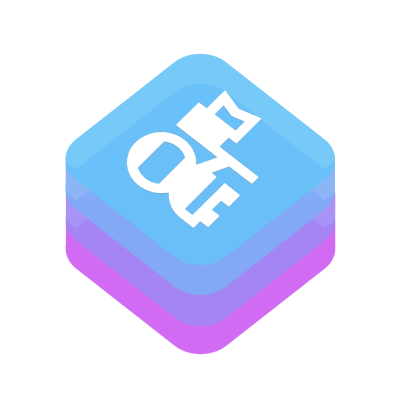

<p align="center">
    
</p>

<p align="center"> 
    <h1>Pioneer</h1>
</p>

[](https://swiftpackageindex.com/d-exclaimation/pioneer)
[](https://swiftpackageindex.com/d-exclaimation/pioneer)

Pioneer is a open-source Swift GraphQL server, for Vapor. Pioneer works with any GraphQL schema built with [GraphQL](https://github.com/GraphQLSwift/GraphQL).

## Getting Started

An overview of GraphQL in general is available in the [README](https://github.com/facebook/graphql/blob/master/README.md) for the [Specification for GraphQL](https://github.com/facebook/graphql). We will be using Graphiti as the GraphQL schema library for this basic implementation. An overview of Graphiti is also described in the package's [README](https://github.com/GraphQLSwift/Graphiti/blob/master/README.md).

### Using Pioneer

Add Graphiti, Vapor and Pioneer to your `Package.swift`:

```swift
import PackageDescription

let package = Package(
    dependencies: [
        .package(url: "https://github.com/GraphQLSwift/Graphiti.git", from: "1.0.0"),
        .package(url: "https://github.com/vapor/vapor.git", from: "4.54.0"),
        .package(url: "https://github.com/d-exclaimation/pioneer", from: "0.1.4")
    ],
    targets: [
        .target(
            name: "MyGraphQLServer",
            dependencies: [
                .product(name: "Pioneer", package: "pioneer"),
                .product(name: "Graphiti", package: "Graphiti"),
                .product(name: "Vapor", package: "vapor")
            ]
        )
    ]
)
```

Pioneer provides all the boilerplate and implemention required to run a GraphQL server on top of Vapor that can handle both over HTTP and over Websocket.

#### Declaring entities

Graphiti was designed not to pollute your entity declarations, so declaring one should be straight forward.

```swift
import Pioneer

struct Message: Codable {
    var id: ID = .uuid()
    var content: String 
}

```

> 💡  _Here we are using, the `ID` type from Pioneer which is just `String` but unique and not meant to be human-readable. The `.uuid()` function will create a new `ID` from an `UUID`. You could have just used the regular initializers_


#### Custom Context type

Graphiti allow usage of custom Context type (with no type pollution) which will pass down to all resolvers. In this case, we will have a authorization token.

```swift
struct Context {
    var token: String?
}
```

> 💡  _Pioneer will ask for a builder function to compute the context from the Vapor `Request` and `Response`. This allows you grab certain value from the request or set new ones to the response_

> ✍️ _Do note that this context will be computed for each request as it require values that are request specific. If you want to have a shared value, make sure you initialize it outside the builder function_

#### Defining the GraphQL resolver

Resolver are just custom struct used to provide resolver functions to all type of GraphQL operation. Pioneer add features to allow use of `async/await` queries, mutations, and subscriptions on top of Graphiti and Vapor.

```swift
import Graphiti
import Pioneer

struct Resolver {
    let (source, supply) = Source<Message>.desolate()
    
    func hello(_: Context, _: NoArguments) async -> Message { 
        Message(content: "Hello World!")
    }
    
    struct Arg: Decodable { 
        var message: String 
    }
    
    func wave(ctx: Context, args: Arg) async throws -> Message {
        guard token != nil else {
            throw GraphQLErrors(message: "Not authorized")
        }
        let message = Message(content: args.message)
        await supply.task(with: .next(message))
        return message
    }

    func listen(_: Context, _: NoArguments) async -> EventStream<Message> {
        source.nozzle().toEventStream()
    }
}
```

> 💡 _Pioneer will automatically handle all subscription as long as the `EventStream`  built from `AsyncSequence`._

<blockquote>

📚 _Turning any generic `AsyncSequence` into an `EventStream` is as easy as calling `.toEventStream()`; however, it's good to provide a termination callback to prevent memory leaks when terminated. `AsyncStream` and `Nozzle` will use its built-in termination callback when not provide otherwise._

<details>
<summary><i>Termination callback example</i></summary>

```swift
let stream = MyAsyncSequence<Message>(...)

stream.toEventStream(
    // Require here as it cannot access `AsyncStream.Continuation.onTermination`
    onTermination: { _ in
        // deallocate resources
    }
)

let stream = AsyncStream<Message> { continuation in 
    // By default will use this termination callback, no need for another callback
    continuation.onTermination = { @Sendable _ in 
        // deallocate resource
    }
}
    
stream.toEventStream()  

let nozzle = Nozzle<Int>(...)

// By default will use this termination callback, no need for another callback
nozzle.onTermination { 
    // deallocate resource
}
    
nozzle.toEventStream()    
```

</details>
</blockquote>


#### Describing the schema

It's time to describe the GraphQL schema

```swift
import Graphiti

func schema() throws -> Schema<Resolver, Context> {
    try .init {
        Scalar(ID.self, as: "ID") // <- Using ID as scalar here
        
        Type(Message.self) {
            Field("id", at: \.id)
            Field("content", at: \.content)
        }

        Query {
            Field("hello", at: Resolver.hello)
        }

        Mutation {
            Field("wave", at: Resolver.wave) {
                Argument("message", at: \.message)
            }
        }

        Subscription {
            SubscriptionField("listen", 
                as: Message.self, 
                atSub: Resolver.listen
            )
        } 
    }
}
```

<blockquote>
    
💡 _Graphiti takes advantage of Swift's `@resultBuilder` to write GraphQL elegantly in Swift code, almost similarly to writing a schema with GraphQL SDL_
    
<details>
<summary><i>Comparing to GraphQL SDL Version</i></summary>

```graphql
type Messsage {
    id: ID!
    content: String!
}

type Query {
    hello: String!
}

type Mutation {
    wave(message: String!): Message!
}

type Subscription {
    listen: Message!
}

schema {
    query: Query,
    mutation: Mutation,
    subscription: Subscription
}
```

</details>
</blockquote>

### Integrating Pioneer, Graphiti, and Vapor

Setting up the server would be fairly straight forward. We will be supplying the `contextBuilder` directly, using the websocket sub-protocol `subscriptions-transport-ws`, and allowing introspection.

```swift
import Vapor
import Pioneer

let app = try Application(.detect())

//  Pioneer server with the schema, resolver, and other configurations
let server = try Pioneer(
    schema: schema(), 
    resolver: Resolver(),
    // Context builder 
    contextBuilder: { req, _ in 
        guard let header: String? = req.headers["Authorization"].first(where: { $0.contains("Bearer") }) else {
            return Context(token: nil)
        }
        let token = header.split(seperator: " ").last?.description
        return Context(token: token)
    },
    websocketProtocol: .subscriptionsTransportWs, 
    introspection: true	
)

// Apply Pioneer routing.
server.applyMiddleware(on: app)

defer { 
    app.shutdown() 
}

try app.run()
```

> 💡 Pioneer is built for Vapor, and it doesn't require complicated setup to add it a Vapor application

Finally, just ran the server with `swift run` and you should be able to make request to the server.

## Feedback

If you have any feedback, please reach out at twitter [@d_exclaimation](https://www.twitter.com/d_exclaimation)
